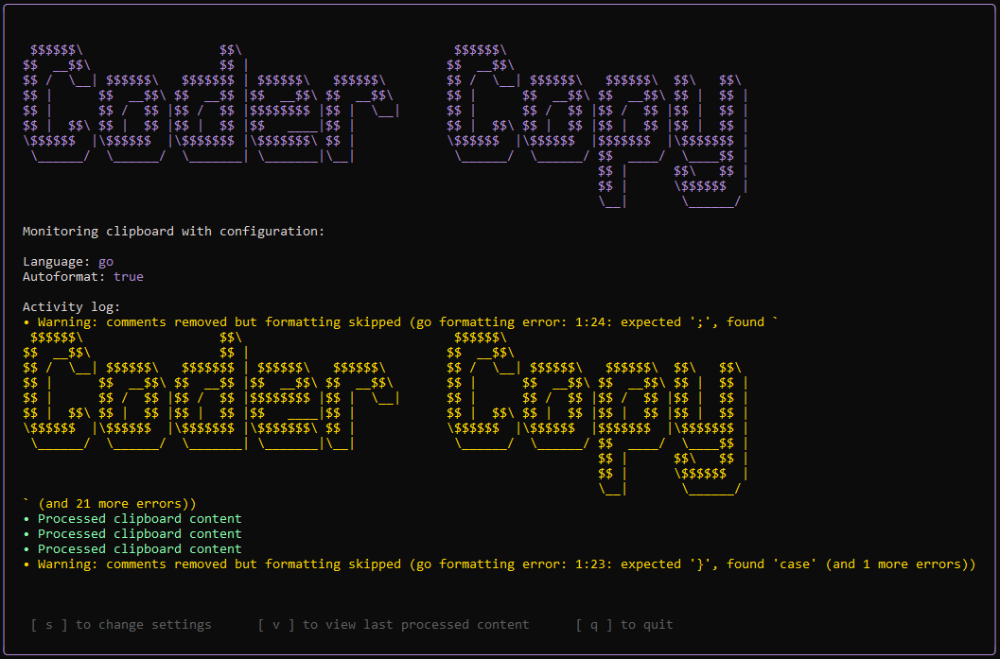

```
 $$$$$$\                  $$\                            $$$$$$\                                
$$  __$$\                 $$ |                          $$  __$$\                               
$$ /  \__| $$$$$$\   $$$$$$$ | $$$$$$\   $$$$$$\        $$ /  \__| $$$$$$\   $$$$$$\  $$\   $$\ 
$$ |      $$  __$$\ $$  __$$ |$$  __$$\ $$  __$$\       $$ |      $$  __$$\ $$  __$$\ $$ |  $$ |
$$ |      $$ /  $$ |$$ /  $$ |$$$$$$$$ |$$ |  \__|      $$ |      $$ /  $$ |$$ /  $$ |$$ |  $$ |
$$ |  $$\ $$ |  $$ |$$ |  $$ |$$   ____|$$ |            $$ |  $$\ $$ |  $$ |$$ |  $$ |$$ |  $$ |
\$$$$$$  |\$$$$$$  |\$$$$$$$ |\$$$$$$$\ $$ |            \$$$$$$  |\$$$$$$  |$$$$$$$  |\$$$$$$$ |
 \______/  \______/  \_______| \_______|\__|             \______/  \______/ $$  ____/  \____$$ |
                                                                            $$ |      $$\   $$ |
                                                                            $$ |      \$$$$$$  |
                                                                            \__|       \______/ 
```

Ever got annoyed copying code only to find it has tons of comments that you need to manually remove? This tool automatically does that for you!

## Overview

Coder Copy monitors your clipboard for code snippets and automatically removes comments, leaving clean, comment-free code ready to paste. It's perfect for sharing code examples, preparing snippets for documentation, or cleaning up code for presentations.

## Screenshots

### Language Selection


### Format Selection


### Monitoring Mode


## Features

- Lightweight clipboard monitoring
- Automatic comment removal
- Code formatting support for multiple languages
- Interactive TUI with easy configuration
- Multi-language support: Go, C/C++, Java, JavaScript/TypeScript, JSX/TSX/React, Python

## Usage

The application is ready to use from the `bin` directory:

```bash
# Default (Go comments)
./bin/coder-copy

# With command-line flags
./bin/coder-copy -go
./bin/coder-copy -python
./bin/coder-copy -js
./bin/coder-copy -jsx
./bin/coder-copy -java
./bin/coder-copy -c

# Enable auto-formatting
./bin/coder-copy -format
````

**Note:** If multiple language flags are provided (like `-c -java`), the tool follows a priority order: C > Java > Python > JS > JSX > Go.

### Interactive Mode

Without command-line arguments, the application starts in interactive mode:

1. Select your programming language using arrow keys (↑/↓) and press Enter
2. Choose whether to enable auto-formatting
3. Start copying code with comments

### Navigation

- Press `s` to change settings while monitoring
- Press `backspace` to return to previous screens
- Press `q` or `ctrl+c` to quit the application

## Workflow

1. Start the application
2. Copy any code containing comments
3. The application automatically processes the code
4. Paste the cleaned code wherever you need it

## Supported Comment Types

- Go/C/Java/JavaScript/React: Single-line (`//`), multi-line (`/* */`), JSX (`{/* */}`)
- Python: Single-line (`#`), triple-quoted docstrings (`'''` and `"""`)

## Formatting Support

Coder Copy can format your code using language-specific formatters:

- Go: Native `go/format` package
- C/C++: clang-format
- Java: google-java-format
- JavaScript/JSX: prettier
- Python: black

External formatters must be installed separately.

## Building and Running

This project requires CGO to be enabled for clipboard functionality.

### Using Make

```bash
# Build the application
make build

# Run the application
make run

# Clean build artifacts
make clean
```

### Manual Build

```bash
# Enable CGO (required for clipboard functionality)
export CGO_ENABLED=1

# Build
go build -o bin/coder-copy cmd/app/main.go

# Run
go run cmd/app/main.go
```

## How It Works

Coder Copy uses language-specific parsing to identify and remove comments while preserving code structure:

- **Smart parsing:** Distinguishes between comments and similar syntax in string literals
- **Language support:** Handles various comment styles across supported languages
- **Clipboard integration:** Monitors clipboard changes using golang.design/x/clipboard
- **Interactive UI:** Built with Bubble Tea for intuitive language selection

## Requirements

- Go 1.16+
- [golang.design/x/clipboard](https://pkg.go.dev/golang.design/x/clipboard) package
- [github.com/charmbracelet/bubbletea](https://github.com/charmbracelet/bubbletea) package
- External formatters (optional): clang-format, google-java-format, prettier, black
